# 🏕️ The Wild Oasis

A modern **hotel management dashboard** built with **React and TypeScript**, designed to manage cabins, bookings, guests, and hotel operations through a clean and responsive interface.

The project was developed while following **The Ultimate React Course by Jonas Schmedtmann**, with the original JavaScript implementation adapted to **TypeScript**.

## 📖 About

**The Wild Oasis** is a full-featured hotel management application that provides hotel staff with a centralized dashboard for managing the day-to-day operations of a hotel.

Users can authenticate securely, manage cabins, create and update bookings, view guest information, and monitor important business statistics through an interactive dashboard.

The project focuses on applying modern React development patterns and building a maintainable frontend architecture using **TypeScript, TanStack React Query, Supabase, React Router, and styled-components**.

## ✨ Features

- 🔐 User authentication
- 👤 User account management
- 🏕️ Create, edit, and delete cabins
- 📅 Manage hotel bookings
- 👥 View and manage guest information
- 📊 Dashboard with hotel statistics
- 📈 Booking and revenue insights
- 🌓 Light and dark mode
- 🔄 Server-state management with TanStack React Query
- ⚡ Optimistic UI updates
- 🗃️ Supabase database integration
- 🔍 Filtering and sorting
- 📱 Responsive dashboard interface
- 🧭 Client-side navigation
- 📝 Form handling and validation
- ♻️ Reusable UI components

## 📸 Screenshots

### 🏠 Dashboard

|                                              ☀️ Light Mode                                               |                                              🌙 Dark Mode                                              |
| :------------------------------------------------------------------------------------------------------: | :----------------------------------------------------------------------------------------------------: |
| 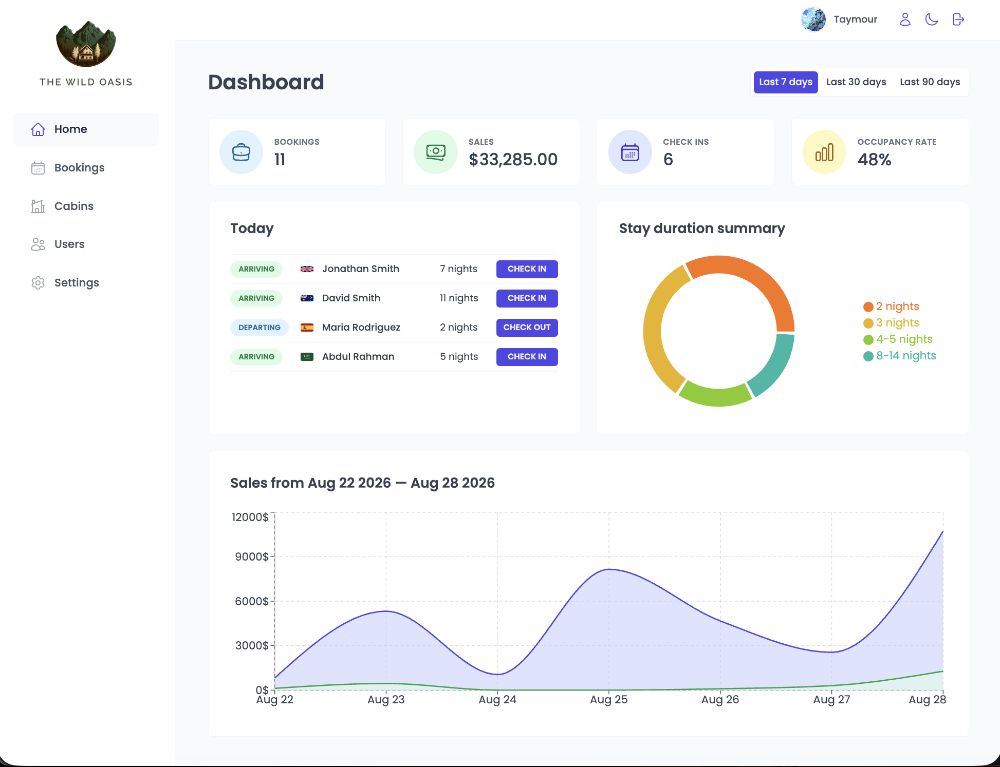 | 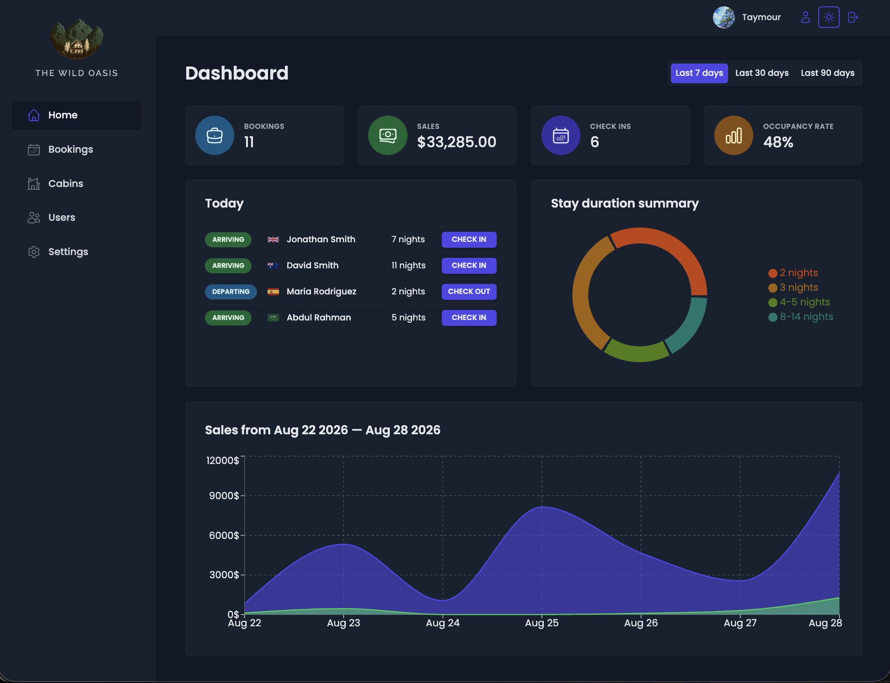 |

The dashboard provides an overview of important hotel metrics, including bookings, sales, occupancy, and other business statistics.

### 📅 Bookings

|                                                    ☀️ Light Mode                                                    |                                                   🌙 Dark Mode                                                    |
| :-----------------------------------------------------------------------------------------------------------------: | :---------------------------------------------------------------------------------------------------------------: |
|       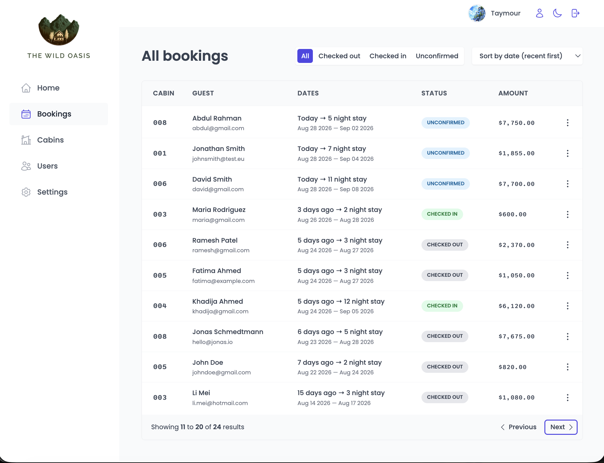        |       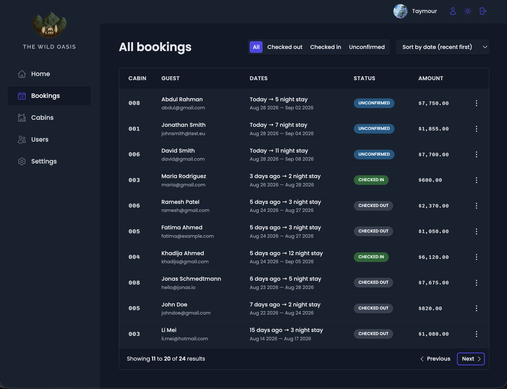        |
| 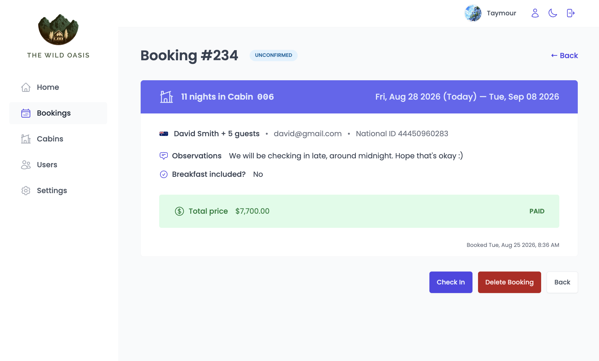 | 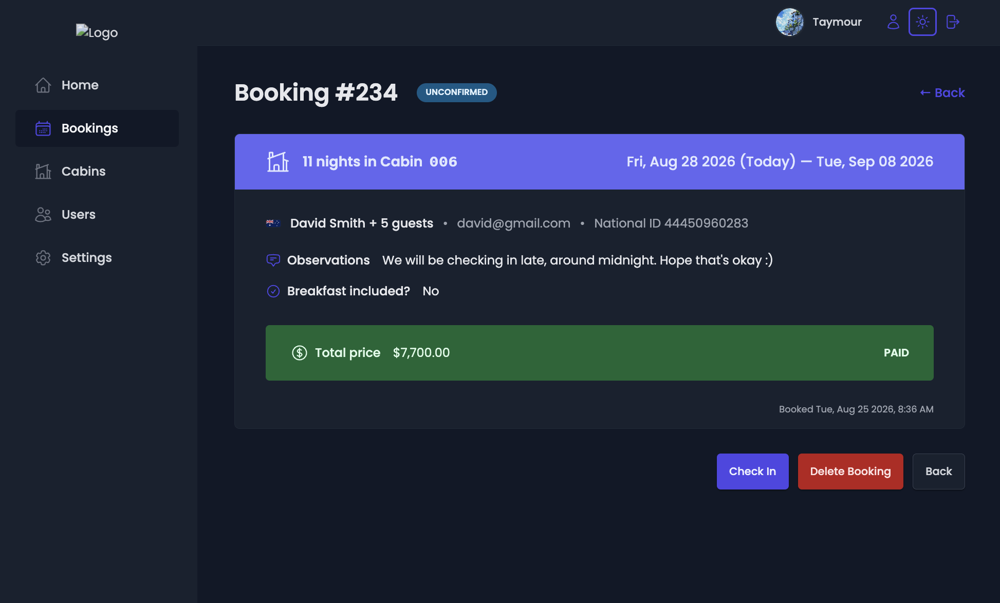 |
|   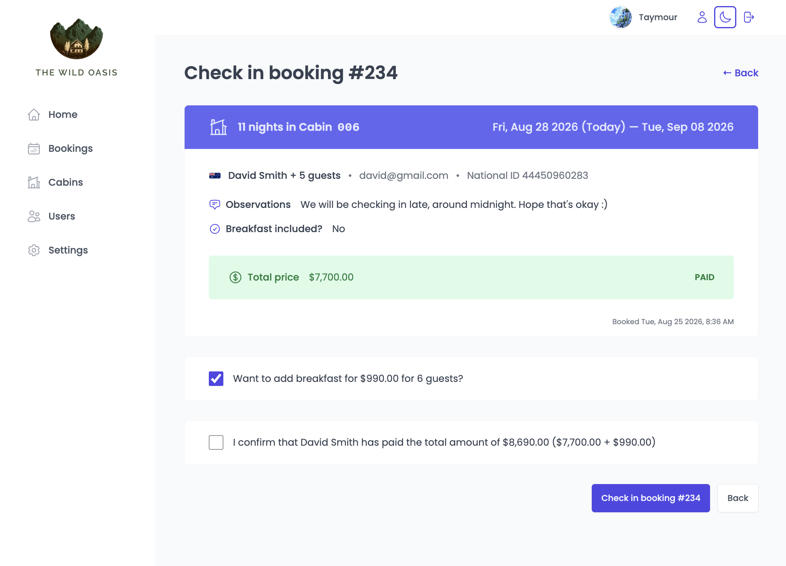    |   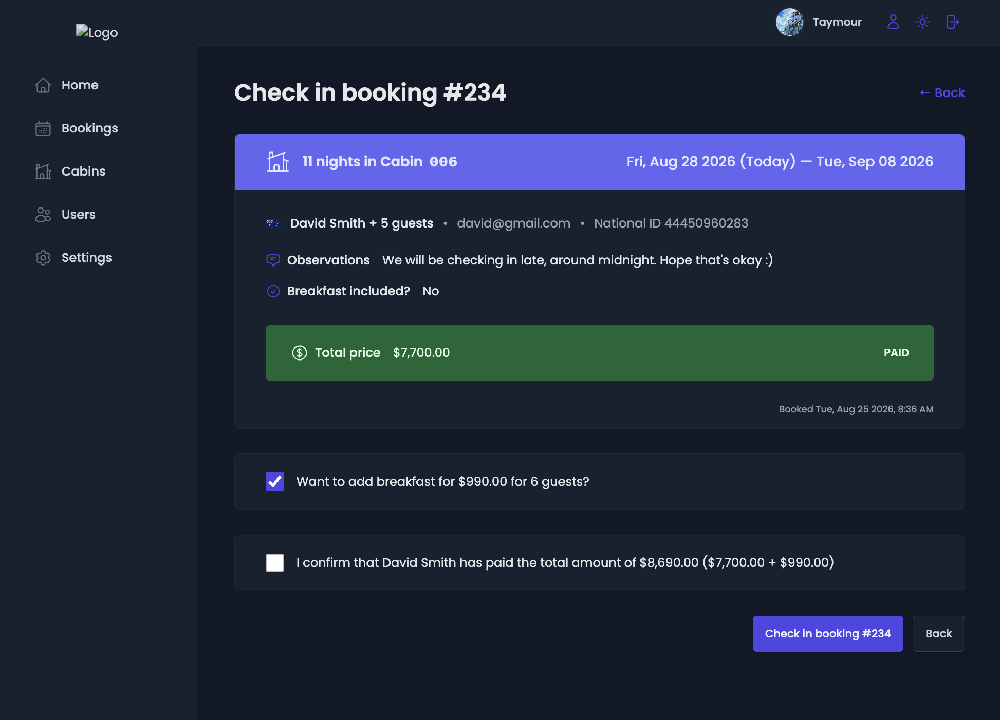    |

Manage hotel bookings, filter reservations, and view detailed information about each booking.

### 🏕️ Cabins

|                                              ☀️ Light Mode                                               |                                              🌙 Dark Mode                                              |
| :------------------------------------------------------------------------------------------------------: | :----------------------------------------------------------------------------------------------------: |
|    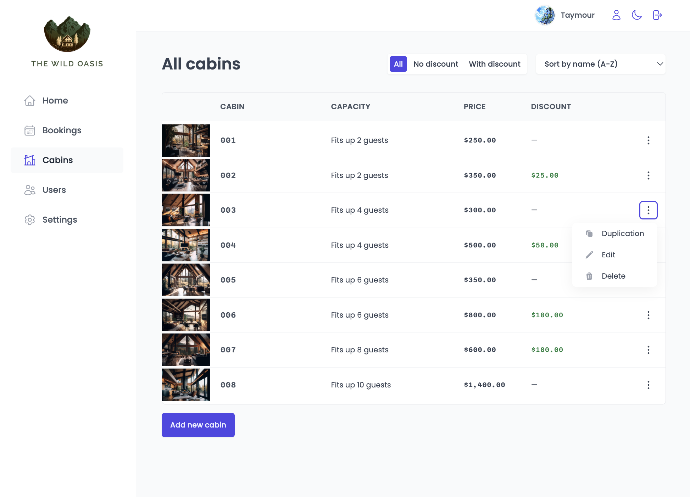    |    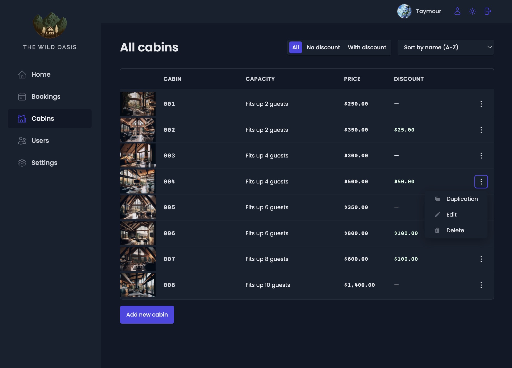    |
| 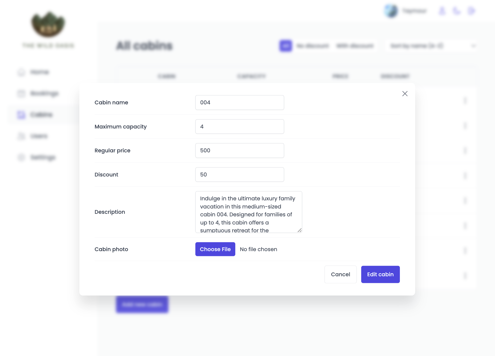 | 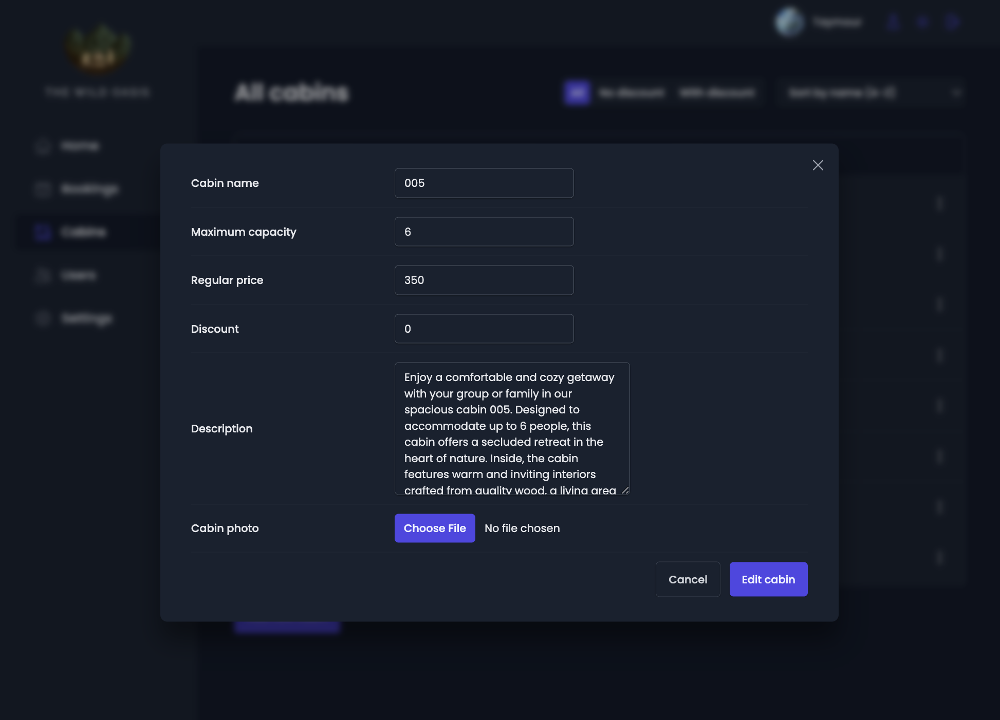 |

Manage the hotel's cabins by creating, editing, deleting, and viewing cabin information.

### ⚙️ Account

|                                            ☀️ Light Mode                                             |                                            🌙 Dark Mode                                            |
| :--------------------------------------------------------------------------------------------------: | :------------------------------------------------------------------------------------------------: |
| 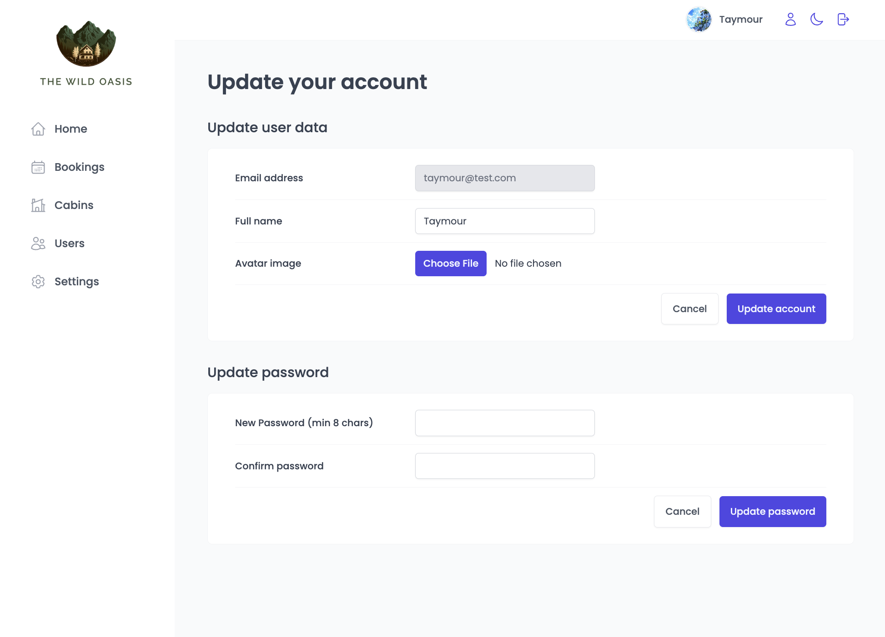 | 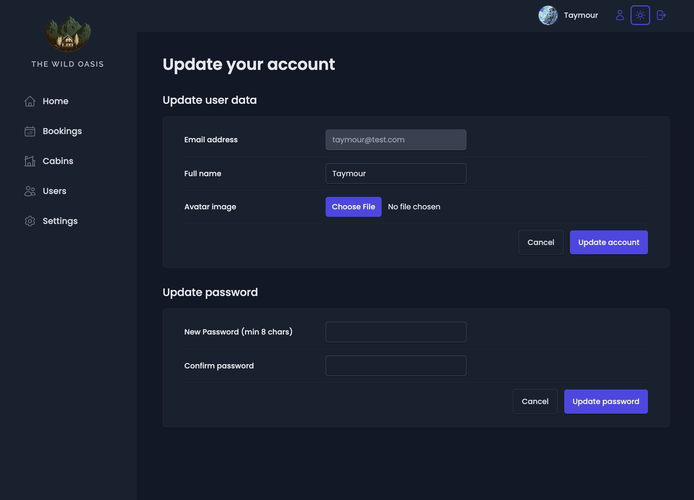 |

Manage account information and application preferences, including the theme.

## 🛠️ Tech Stack

### Frontend

- **React**
- **TypeScript**
- **React Router**
- **TanStack React Query**
- **styled-components**
- **React Hook Form**

### Backend & Data

- **Supabase**
  - PostgreSQL database
  - Authentication
  - Storage

### Development Tools

- **Vite**
- **ESLint**
- **Prettier**
- **TypeScript ESLint**

## 🏗️ Architecture & Concepts

This project gave me the opportunity to practice building a larger React application with a clear separation between UI state and server state.

Some of the main concepts implemented include:

- Component-based architecture
- Reusable and composable components
- Custom React hooks
- Global UI state management
- Server-state management with **TanStack React Query**
- Query caching and invalidation
- Mutations and optimistic updates
- Authentication and protected routes
- CRUD operations
- Form handling and validation
- URL-based state
- Reusable styled-components
- Responsive UI design
- Light/dark theme implementation
- Type-safe development with TypeScript

## ⚙️ Getting Started

### Prerequisites

Make sure you have **Node.js** and **npm** installed.

### 1. Clone the repository

```bash
git clone https://github.com/YOUR_USERNAME/the-wild-oasis.git
```

### 2. Navigate to the project

```bash
cd the-wild-oasis
```

### 3. Install dependencies

```bash
npm install
```

### 4. Configure environment variables

Create a `.env` file in the root directory:

```env
VITE_SUPABASE_URL=your_supabase_url
VITE_SUPABASE_KEY=your_supabase_anon_key
VITE_PAGE_SIZE=10
```

> Never commit your `.env` file or expose private credentials in the repository.

### 5. Start the development server

```bash
npm run dev
```

The application will be available at the local URL provided by Vite.

## 📦 Available Scripts

| Command           | Description                          |
| ----------------- | ------------------------------------ |
| `npm run dev`     | Start the development server         |
| `npm run build`   | Build the application for production |
| `npm run lint`    | Run ESLint                           |
| `npm run preview` | Preview the production build         |

## 🎯 Learning Goals

The main goal of this project was to move beyond small React applications and practice building a more complete, real-world dashboard application.

In particular, I used this project to strengthen my knowledge of:

- **React with TypeScript**
- **Server-state management**
- **Data fetching and caching**
- **Authentication**
- **CRUD operations**
- **Forms and validation**
- **Routing**
- **Reusable component design**
- **Responsive UI development**
- **Dark/light theme implementation**
- **Modern React best practices**

## 📚 Based On

This project was developed while following **The Ultimate React Course by Jonas Schmedtmann**.

The course project was originally implemented using JavaScript. I chose to implement the project using **TypeScript** to strengthen my understanding of type-safe React development and gain practical experience migrating concepts from JavaScript to TypeScript.

## 👨‍💻 Author

**Abdelrahman Taymour**

Computer Science Graduate | .NET Backend & Full-Stack Developer

Interested in building scalable backend systems and modern full-stack applications using **.NET, React, TypeScript, and modern software architecture principles**.

---

⭐ If you found this project interesting, feel free to check out the repository and explore the code.
